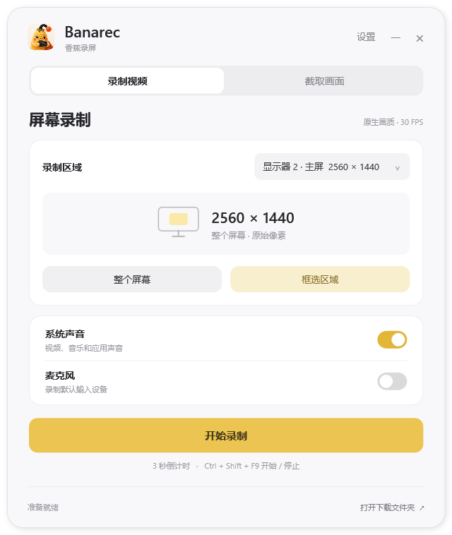
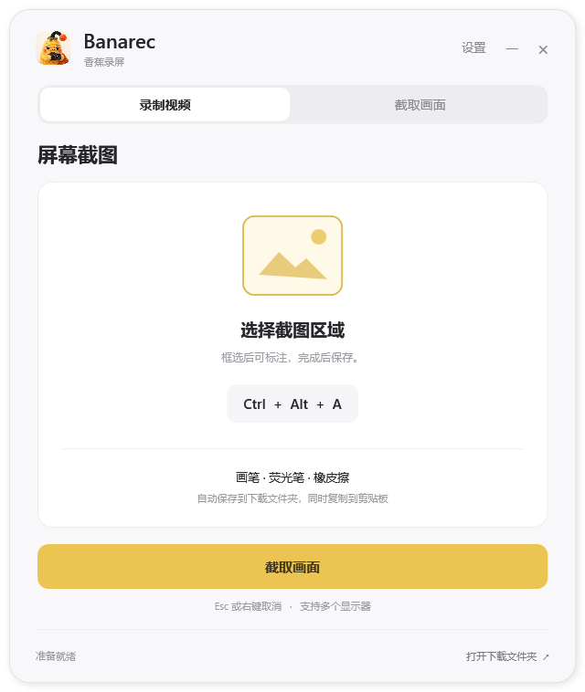
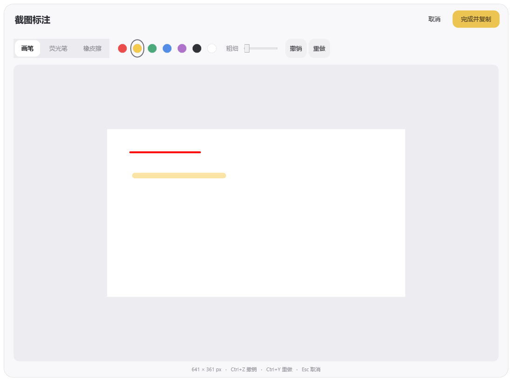

<p align="center">
  
</p>

<h1 align="center">Banarec · 香蕉录屏</h1>

<p align="center">Windows 录屏与截图工具</p>

<p align="center">
  <a href="https://github.com/visongemini/Banarec/releases/latest">下载安装包</a> ·
  <a href="#快捷键">快捷键</a> ·
  <a href="#从源码构建">从源码构建</a>
</p>

## 界面

<p align="center">
  
  
</p>

暖白界面、圆角控件、独立的录屏与截图入口。图标是拿着摄像机的蕉仔 Banny。

## 功能

### 录屏

- 选择显示器，全屏录制或拖动框选区域。
- 按原始像素录制，保存为高画质 H.264 MP4；可选 30 / 60 FPS。
- 系统声音与麦克风独立开关，两者都开时混合为一条音轨。
- 3 秒倒计时，录制时显示红色区域边框。
- 可拖动的置顶浮框，显示计时、声音状态及停止按钮。
- 在支持的 Windows 环境中，边框和浮框不出现在录像中。
- 提供 CPU 兼容模式；正常退出时先停止并保存录像。

### 截图

- **Ctrl + Alt + A** 启动框选截图，支持多个显示器。
- 框选后进入标注窗口：画笔、荧光笔、橡皮擦、7 种颜色和笔迹粗细。
- 支持撤销 / 重做；点击“完成并复制”后保存原始分辨率 PNG，同时复制到剪贴板。
- Esc 或鼠标右键取消。
- 保留选区的实际像素尺寸，包括奇数宽高。

### 保存与常驻

- 文件自动保存在 Windows **下载**文件夹，支持重定向后的下载位置。
- 按日期、时间及短随机后缀命名，避免覆盖。
- 关闭主窗口后驻留托盘；右键托盘可完全退出。
- 可设置登录自动启动，启动时只驻留托盘。
- 不联网、不上传录制内容。

### 截图标注



## 安装

1. 在 [Releases](https://github.com/visongemini/Banarec/releases/latest) 下载 `Banarec-Setup-2.1.0.exe`。
2. 运行安装程序，可选择创建桌面快捷方式和登录自动启动。
3. 从桌面或开始菜单打开 **Banarec · 香蕉录屏**。

安装包约 **2.7 MB**，当前安装目录约 **5.9 MB**（包括卸载程序，不包括系统运行库）。

### 系统要求

- Windows 10 2004 或更新版本 / Windows 11，x64。
- .NET Framework 4.8。
- Microsoft Visual C++ 2015–2022 x64 运行库。
- 系统可用的 Media Foundation；Windows N / KN 版本需安装对应媒体功能包。

安装包不捆绑上述系统运行库。未进行代码签名的版本可能显示“未知发布者”。

## 快捷键

| 操作 | 快捷键 |
| --- | --- |
| 框选截图 | **Ctrl + Alt + A** |
| 开始 / 停止录屏 | **Ctrl + Shift + F9** |
| 取消区域选择 | **Esc** 或右键 |

当其他程序已注册 Ctrl + Alt + A 时，Banarec 会在运行期间优先响应这一组合键。可在**偏好设置 → 全局截图快捷键**中关闭。Ctrl + A 保持正常全选行为。

该兼容机制仅判断截图组合键，不收集、保存或传输键入内容。

## 使用说明

- **系统声音**使用 Windows 默认输出设备；**麦克风**使用默认输入设备。
- 没有麦克风声音时，检查默认输入设备及 Windows 桌面应用麦克风权限。
- 硬件录制失败时，可在偏好设置中开启**兼容模式**后重试。
- 正常停止后，等待保存完成再关机。强制结束进程可能导致 MP4 不完整。
- H.264 录屏宽高需对齐偶数，奇数选区会向内减少 1 像素；截图不受此限制。
- 录屏一次选择一块显示器中的区域；截图可以跨显示器。
- 正在录屏时，需要先结束当前录制再截图。
- 实际帧率和清晰度受屏幕、编码器和电脑性能影响；不会通过放大画面制造更高分辨率。

### 文件位置

| 内容 | 位置 |
| --- | --- |
| 安装目录 | `%LOCALAPPDATA%\Programs\Banarec` |
| 设置 | `%LOCALAPPDATA%\Banarec\settings.ini` |
| 错误日志 | `%LOCALAPPDATA%\Banarec\errors.log` |
| 录像与截图 | Windows 下载文件夹 |

通过 Windows **设置 → 应用 → Banarec · 香蕉录屏**卸载。卸载不会删除已保存的截图和录像。

## 从源码构建

项目使用 **C#、WPF、WinForms 和 ScreenRecorderLib 7.0.1**。构建脚本使用 Windows .NET Framework 自带的 x64 C# 编译器。

在 Windows PowerShell 中，从仓库根目录运行：

```powershell
.\build.ps1
```

脚本会下载固定版本的 ScreenRecorderLib NuGet 包并校验 SHA-256，然后生成 `release\Banarec.exe`。首次构建需要联网，后续可使用缓存。无需把凭据写入项目。

### 构建安装包

安装 [Inno Setup 6](https://jrsoftware.org/isdl.php) 后运行：

```powershell
.\scripts\package.ps1 -CompilerPath 'C:\Program Files (x86)\Inno Setup 6\ISCC.exe'
```

输出为 `dist\Banarec-Setup-2.1.0.exe`。安装包以当前用户权限安装，不需要管理员服务。

### 验证

```powershell
# 需要已解锁的 Windows 桌面；会临时打开测试窗口并生成测试录像
.\scripts\test.ps1 -Suite Integration

# 额外检查全局截图快捷键和 Ctrl+A
.\scripts\test.ps1 -Suite Hotkey
```

测试会短暂使用屏幕和剪贴板，并尝试恢复原有剪贴板及设置。测试输出保存在 `tests\artifacts`，不会提交到仓库。请在没有敏感内容的桌面运行。详见 [测试说明](tests/README.md)。

## 当前验证范围

已在开发机验证：

- 录屏、截图和设置界面渲染。
- PNG 选区尺寸、剪贴板复制、截图取消，以及笔迹颜色、荧光笔、橡皮擦、撤销 / 重做和原始尺寸导出。
- 倒计时取消、重新录制、浮框停止及 MP4 保存。
- 新版录制文件通过 FFmpeg 完整解码检查。
- Ctrl + Alt + A 在存在占用时触发一次截图，Ctrl + A 正常全选。
- 安装、桌面 / 开始菜单快捷方式及托盘启动模式。

**尚未完整验证：**长时间连续录制、4K / 60 FPS、特殊独占全屏、不同 DPI 的多屏组合，以及其他电脑的兼容性。受保护的视频和安全桌面可能无法录制。

## 目录

```text
src/             应用、界面、录制和截图逻辑
assets/          蕉仔应用图标
docs/            界面预览、版本说明
scripts/         依赖恢复、安装包和测试脚本
tests/           Windows 桌面集成测试源码
third_party/     第三方许可和安装程序语言文件
build.ps1        应用构建入口
installer.iss    Inno Setup 安装脚本
```

## 第三方与素材

- [ScreenRecorderLib](https://github.com/sskodje/ScreenRecorderLib)：MIT，完整许可见 [third_party/ScreenRecorderLib.LICENSE](third_party/ScreenRecorderLib.LICENSE)。
- 安装程序使用 Inno Setup；构建者应遵循其使用条款。
- 简体中文安装语言文件来自 [Inno Setup Chinese Simplified Translation](https://github.com/kira-96/Inno-Setup-Chinese-Simplified-Translation)。
- 蕉仔图标基于项目提供的角色设定图，通过 imagegen 生成。详见 [素材说明](assets/README.md)。

本项目暂未指定代码的开源许可证。仓库公开不代表对蕉仔角色、名称或品牌素材授予额外使用许可。
